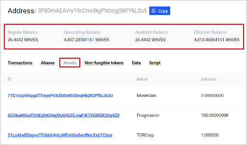

# Account Balance

**Account balance** is the amount of the [token (asset)](/en/blockchain/token/) that belongs to the [account](/en/blockchain/account/).

One account can store different tokens in different amounts. For example, an account can have 50 [WAVES](/en/blockchain/token/waves) and 200 USD-N at the same time. The amount of the Y token on the account is called the **account balance in Y token**. If there is no Y token on the account, it is said that the **account balance in Y token is equal to zero**.

## Account balance in WAVES

There are four types of balances in WAVES:

* regular
* available
* effective
* generating

The **regular balance** is the amount of WAVES that belongs directly to the account.

Thе other types of balances are determined counting [leased WAVES](/en/blockchain/leasing).

Let us introduce the following notation:

`R` is the regular balance,

`Lo` is the amount of WAVES which the account leased to other accounts,

`Li` is the amount of WAVES which are leased to the account by other accounts.

Then:

**Available balance** = `R` – `Lo`

**Effective balance** = `R` – `Lo` + `Li`

**Generating balance** is the minimum value of the effective balance during the last 1000 [blocks](/en/blockchain/block/).

The generating balance of a [node](/en/blockchain/node/) account affects the ability to participate in block generation. To generate blocks, you need a generating balance of at least 1000 WAVES. The larger the generating balance, the greater the chance to add the next block is.

## View Account Balance

The balances of any account, as well as other blockchain data, are public and can be read by anyone. For example, you can see the list of tokens ant their amount on the account in [Waves Explorer](https://wavesexplorer.com). To do this, find an account by its [address](/en/blockchain/account/address) or [alias](/en/blockchain/account/alias). Balances in WAVES are displayed right under the address, balances in other assets are at the **Assets** tab, and [non-fungible tokens (NFT)](/en/blockchain/token/non-fungible-token) are at the **Non-fungible tokens** tab.

You can also obtain balances using [Node REST API](/en/waves-node/node-api/) and [client libraries](/en/building-apps/waves-api-and-sdk/client-libraries/), see the examples in the [How to Retrieve Information from the Blockchain](/en/building-apps/how-to/basic/retrieve) article.

## Top up Balance

You can buy WAVES tokens at [Waves.Exchange](https://waves.exchange/) developed by the third-party team from the community, or at one of the [centralized exchanges](https://coinmarketcap.com/currencies/waves/markets/).

On [Testnet and Stagenet](/en/blockchain/blockchain-network/), you can get WAVES for free using the Faucet:

* <https://testnet.wavesexplorer.com/faucet> for Testnet
* <https://stagenet.wavesexplorer.com/faucet> for Stagenet.
