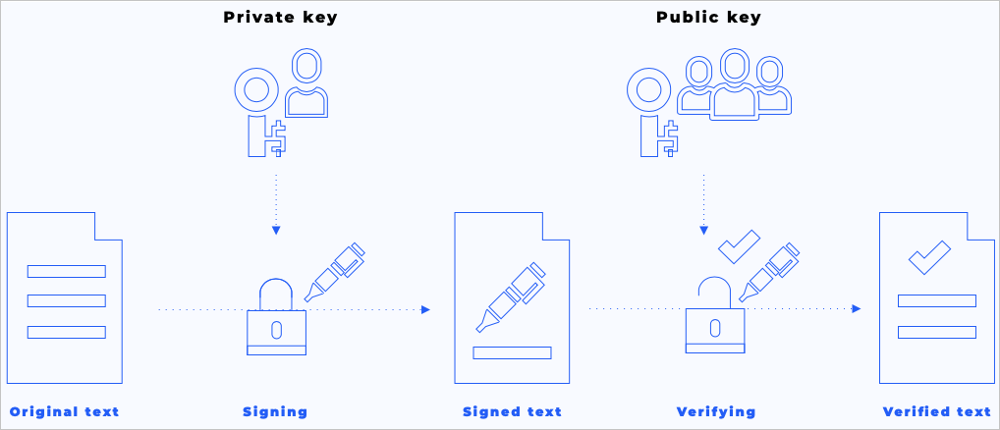

# Account

Waves uses an account-based model:
* Each [transaction](/en/blockchain/transaction/) is created on behalf of a certain account.
* All the [tokens](/en/blockchain/token/) belong to certain accounts. For details, see the [Account Balance](/en/blockchain/account/account-balance) article.
* All data are associated with accounts. For details, see the [Account Data Storage](/en/blockchain/account/account-date-storage) article.

## Account Keys

Unlike centralized applications, users do not have usernames and passwords on the blockchain. User identification and validation of their actions are performed using a cryptographically bound key pair:

* The private key is used to sign transactions or orders.
* The public key allows to verify the digital signature.

Each transaction contains the public key of the sender account. The sender generates a digital signature on the transaction using the account's private key. The signature and the sender's public key are used to verify the authenticity of the transaction data and to check that the signature of the transaction matches the public key.



Waves uses an asymmetric cryptographic system based on the elliptic curve Curve25519-ED25519 with X25519 keys. 
The guideline for generating keys and signatures is given in the [Cryptographic practical details](/en/blockchain/waves-protocol/cryptographic-practical-details#signing) article.

The private and public keys are 32 byte arrays. In UIs, the keys are displayed as [base58](https://en.bitcoin.it/wiki/Base58Check_encoding) encoded strings. Base58-encoded keys can be of different length, the maximum length is 44 characters.

Example private key in base58:

```
6yCStrsBs4VgTmYcSgF37pmQhCo6t9LZk5bQqUyUNSAs
```

Example public key in base58:

```
5cqzmxsmFPBHm4tb7D8DMA7s5eutLXTDnnNMQKy2AYxh
```

## Secret (Seed) Phrase

Not every 32 byte array can be a private key. The private key can be generated from some random seed phrase using hashing functions. The public key is obtained from the private key using an elliptic curve multiplication. Account [address](/en/blockchain/account/address) is obtained from the public key. All these transformations are unidirectional. The opposite direction is almost impossible in terms of the required computations.


The **secret phrase** (a.k.a. seed phrase, backup phrase) can be any combination of symbols, words, or bytes. Waves wallet apps typically use a random set of 15 English words out of 2048 words available. Using such a phrase is secure: the probability of generating two identical seed phrases is 1/2048<sup>15</sup>, so brute-force will take millions of years on an average CPU. The point of using a secret phrase (rather than a private key) is to simplify user experience: the secret phrase is much easier to write down or remember.

Example of a secret phrase:

```
body key praise enter toss road cup result shrimp bus blame typical sphere pottery claim
```

:warning: **Security Information**
* The secret phrase or the private key derived from it provides complete control over the account, including the ability to dispose of funds. Do not give your secret phrase and private key to anyone, and do not publish or send them.
* The secret phrase cannot be changed: another secret phrase (even one that differs by single character) will generate a different key pair, and therefore a different account.
* If you lose your secret phrase and private key, you will no longer be able to access your account permanently. We strongly encourage that you write down the secret phrase on a piece of paper and store it in a safe place.
* If the secret phrase is compromised (you have accidentally sent it to someone or suspect that it was taken by fraudsters), immediately create a new account and transfer all assets to it.

For ways to generate account keys, see the [How to Create Account / Waves Wallet](/en/blockchain/account/create) article.
