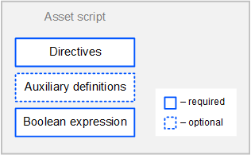

# Asset Script

Asset script verifies transactions within the [asset (token)](/en/blockchain/token), that is, allows or denies the transaction depending on the specified conditions.

:warning: Please note: the asset script can only verify transactions, but not orders.

Asset with a script assigned to it is called a [smart asset](/en/building-apps/smart-contracts/smart-assets).

## Asset Script Format

The script code is composed of the following parts:

* [Directives](#directives)
* [Auxiliary definitions](#auxiliary-definitions)
* [Boolean expression](#boolean-expression)



### Directives

The asset script should start with [directives](/en/ride/script/directives):

```scala
{- # STDLIB_VERSION 4 # -}
{- # CONTENT_TYPE EXPRESSION # -}
{- # SCRIPT_TYPE ACCOUNT # -}
```

The above directives tell the compiler that:

- the script uses the Standard Library version 4,
- the script contains a boolean expression,
- the script will be assigned to an asset.

### Auxiliary Definitions

After the directives, you can define auxiliary variables and functions.

Example:

```scala
let someConstant = 42
func doSomething () = {
    height + someConstant
}
```

### Boolean Expression

The expression checks transactions involving the asset for compliance with the specified conditions. If the conditions are not met, the transaction is denied. Possible results of evaluating the expression are:

* true: the transaction is allowed,
* false: the transaction is denied,
* error: the transaction is denied.

Using the [match ... case](/en/ride/operators/match-case) operator, you can set up different conditions depending on the type of the transaction. For example, the following expression prohibits changing the asset script and allows other transactions:

```
match tx {
  case t : SetAssetScriptTransaction => false
  case _ => true
}
```

## Failed Transactions

If the asset script denies the [Exchange transaction](/en/blockchain/transaction-type/exchange-transaction) (provided that the sender signature verification or the account script verification passed), the transaction is saved on the blockchain but marked as failed (`"applicationStatus": "script_execution_failed"`). The sender of the transaction (matcher) is charged a fee. The transaction doesn't entail any other changes in balances, in particular, the order senders don't pay the matcher fee.

If the asset script denies the [Invoke Script transaction](/en/blockchain/transaction-type/exchange-transaction) (provided that the sender signature verification or the account script verification passed and the complexity of calculations performed by dApp script exceeded the [threshold for saving failed transactions](/en/ride/limits/)), the transaction is saved on the blockchain but marked as failed (`"applicationStatus": "script_execution_failed"`). The transaction sender is charged a fee. The transaction doesn't entail any other changes on the blockchain.

[More about transaction validation](/en/blockchain/transaction/transaction-validation)

[More about handling failed transactions](/en/keep-in-touch/april)

## Data Accessible to Asset Script

The following data can be used for checks:

* [Blockchain data](/en/ride/#blockchain-operation): current height, account balances, entries in account data storages, parameters of tokens, etc.
* Fields of the current verified transaction, excluding `proofs`. The built-in variable `tx` contains this transaction. The set of fields depends on the type of transaction, see the [Transaction Structures](/en/ride/structures/transaction-structures/) chapter.

## Examples

Find the asset scripts examples:
* in the [Smart Asset](/en/building-apps/smart-contracts/smart-asset) article;
* in [Waves IDE](/en/building-apps/smart-contracts/tools/waves-ide): **Library → smart-assets**.
