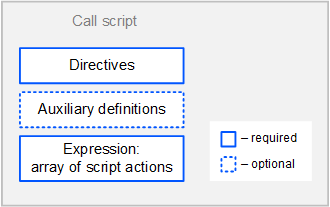

# [Ride v6] Call Script

Call script is designed to be executed once by an [Invoke Expression Transaction](/en/blockchain/transaction-type/invoke-expression-transaction).

> Call script type is added in Standard library version 6.

## Call Script Format

The script code is composed of the following parts:

* [Directives](#directives)
* [Auxiliary definitions](#auxiliary-definitions)
* [Executable expression](#executable-expression)



### Directives

The call script should start with [directives](/en/ride/script/directives):

```scala
{-# STDLIB_VERSION 6 #-}
{-# CONTENT_TYPE EXPRESSION #-}
{-# SCRIPT_TYPE CALL #-}
```
The above directives tell the compiler that:

- the script uses the Standard library version 6,
- the script contains an expression,
- the script will be executed by an Invoke Expression transaction.

### Auxiliary Definitions

After the directives, you can define auxiliary variables and functions.

Example:

```scala
let someConstant = 42
func doSomething () = {
    height + someConstant
}
```

### Executable Expression

Expression result is an array of [script actions](/en/ride/structures/script-actions/) to be performed on the blockchain: adding/deleting/modifying entries in the account data storages, token issue/reissue/burning/transfers, and others.

## ## Data Accessible to Call Script

* Particular fields of the Invoke Script transaction that executes the script: fee, sender address, public key, and others. The built-in variable `i` of type [Invocation](/en/ride/structures/common-structures/invocation) contains this data. Proofs are not available.
* [Blockchain data](/en/ride/#blockchain-operation): current height, account balances, entries in account data storages, parameters of tokens, etc.

## Example

Below is an example script that issues a token, transfers it to two addresses, and writes recipient information to the account data storage.

```scala
{-# STDLIB_VERSION 6 #-}
{-# CONTENT_TYPE EXPRESSION #-}
{-# SCRIPT_TYPE CALL #-}

let address1 = Address(base58'3Myqjf1D44wR8Vko4Tr5CwSzRNo2Vg9S7u7')
let address2 = Address(base58'3MsNbupKQ1Zf5yVo952AkFiKu2rh4oevWeC')

let t = Issue("MyToken", "", 1000000, 2, true)
let tid = calculateAssetId(t)

[
   t,
   ScriptTransfer(address1, 500000, tid),
   ScriptTransfer(address2, 500000, tid),
   IntegerEntry("3Myqjf1D44wR8Vko4Tr5CwSzRNo2Vg9S7u7", 500000),
   IntegerEntry("3MsNbupKQ1Zf5yVo952AkFiKu2rh4oevWeC", 500000),
]
```
