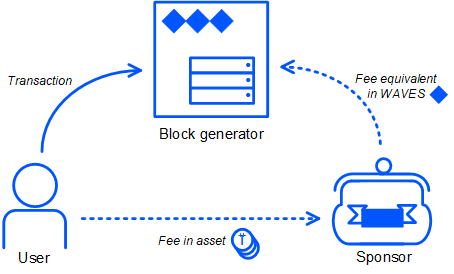

# Спонсирование комиссии

Необходимость платить комиссию за каждую транзакцию может стать препятствием для привлечения новых пользователей децентрализованных приложений. Иногда пользователи не знают ничего о WAVES, или не понимают, где взять WAVES, или не хотят тратить средства. Механизм спонсирования позволяет создавать приложения, которые не требуют наличия WAVES у пользователя.

## Спонсорский ассет

Аккаунт, выпустивший ассет, может сделать его спонсорским — разрешить любым пользователям платить в этом ассете комиссию за транзакции вызова скрипта и транзакции перевода. Спонсорский ассет можно распределить среди пользователей приложения.

## Как работает спонсирование

После [включения спонсирования](#как-включить-спонсирование) и при условии, что выполнены [ограничения](#ограничения), механизм работает следующим образом:

1. Пользователь отправляет транзакцию и указывает комиссию в спонсорском ассете.
2. Спонсор получает сумму комиссии в спонсорском ассете со счета пользователя.
3. Генераторы блоков получают комиссию в WAVES за счет спонсора (в соответствии с [протоколом Waves-NG](/ru/blockchain/waves-protocol/waves-ng-protocol) комиссия распределяется между генератором текущего и следующего блока в соотношении 40/60).

> Скрипт на аккаунте спонсора не выполняется и не влияет на спонсирование, поскольку транзакция отправлена с аккаунта пользователя.

Комиссия в WAVES, взимаемая со спонсора, пропорциональна комиссии, указанной отправителем транзакции:

`feeInWaves` = `feeInSponsoredAsset` × 0,001 / `minSponsoredAssetFee`

`minSponsoredAssetFee` — количество спонсорского ассета, эквивалентное 0,001 WAVES. Спонсор устанавливает эту величину при включении спонсирования.

Например, если спонсор установил соотношение 3 токена = 0,001 WAVES, то минимальная комиссия за транзакцию вызова скрипта составит 15 токенов, что соответствует 0,005 WAVES.

:warning: Обратите внимание:

* Пользователь может использовать спонсорский ассет для оплаты транзакций, не связанных с использованием конкретного приложения.
* Пользователь может указать любую сумму комиссии, в том числе значительно превышающую минимальную.

## Как включить спонсирование

Чтобы включить спонсирование, нужно отправить транзакцию спонсирования, указав в ней `minSponsoredAssetFee`. [Пример транзакции](https://testnet.wavesexplorer.com/tx/5gHUMzmBfn4KP3tELzHtw3EYR947rzWUp5PuyF7hUW23)

> В бинарном и JSON-представлении транзакции спонсирования значение `minSponsoredAssetFee` указывается в минимальных единицах («копейках») спонсорского ассета.

Создать транзакцию спонсирования можно:
* В приложении [Waves.Exchange](https://waves.exchange/), разработанном сторонней командой из сообщества. См. раздел [Спонсорская транзакция](https://docs.waves.exchange/ru/waves-exchange/waves-exchange-online-desktop/online-desktop-asset/online-desktop-sponsored-trx) документации Waves.Exchange.
* С помощью одной из [клиентских библиотек](/ru/building-apps/waves-api-and-sdk/client-libraries/). См. также примеры в разделе [Создание и отправка транзакций](/ru/building-apps/how-to/basic/transaction).

Комиссия за транзакцию спонсирования — 1 WAVES (после активации фичи №&nbsp;15 “Ride V4, VRF, Protobuf, Failed transactions” — 0,001 WAVES).

## Как отключить спонсирование

Чтобы отключить спонсирование, нужно отправить транзакцию спонсирования, указав `null` в качестве `minSponsoredAssetFee`.

## Ограничения

* Только аккаунт, выпустивший ассет, может включать и выключать спонсирование.
* Смарт-ассет не может быть спонсорским.
* Спонсирование работает, только если баланс аккаунта спонсора больше 1,005 Waves. Когда баланс становится меньше, спонсирование приостанавливается, когда больше — возобновляется.
* Комиссия в спонсорском ассете предусмотрена только для транзакций вызова скрипта и транзакций перевода.

## Обсуждение

Дальнейшее развитие спонсирования обсуждается на форуме Waves в разделе [WEP-2 Customizable Sponsorship](https://forum.wavesplatform.com/t/wep-2-customizable-sponsorship/15880).
