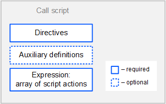

# [Ride v6] Cкрипт вызова

Скрипт вызова предназначен для однократного выполнения на блокчейне с помощью [транзакции применения выражения](/ru/blockchain/transaction-type/invoke-expression-transaction).

> Скрипт вызова добавлен в Стандартной библиотеке версии 6.

## Формат скрипта вызова

Код скрипта состоит из следующих частей:

* [Директивы](#directives)
* [Вспомогательные определения](#definitions)
* [Применяемое выражение](#expression)



### <a id="directives"></a>Директивы

Cкрипт вызова начинается с [директив](/ru/ride/script/directives):

```scala
{-# STDLIB_VERSION 6 #-}
{-# CONTENT_TYPE EXPRESSION #-}
{-# SCRIPT_TYPE CALL #-}
```

Приведенные директивы сообщают компилятору, что:

- в скрипте используется Стандартная библиотека версии 6;
- скрипт содержит выражение;
- скрипт будет выполнен с помощью транзакции применения выражения.

### <a id="definitions"></a>Вспомогательные определения

После директив можно определить вспомогательные переменные и функции.

Пример определений:

```scala
let someConstant = 42
func doSomething() = {
    height + someConstant
}
```

### <a id="expression"></a>Применяемое выражение

Результат выражения — массив [действий скрипта](/ru/ride/structures/script-actions/), которые будут выполнены на блокчейне: добавление/удаление/изменение записей в хранилище данных аккаунта, выпуск/довыпуск/сжигание/перевод токена и др.

## Данные, доступные скрипту вызова

* Часть полей транзакции применения выражения, которая выполняет скрипт: комиссия за транзакцию, адрес и открытый ключ отправителя и др. Встроенная переменная `i` с типом [Invocation](/ru/ride/v6/structures/common-structures/invocation) содержит эти данные. Подтверждения (`proofs`) недоступны.
* [Данные блокчейна](/ru/ride/#blockchain-operation): текущая высота, балансы аккаунтов, записи в хранилищах данных аккаунтов, параметры токенов и др.

## Пример

Ниже приведен пример скрипта, который выпускает токен, переводит его двум адресам и записывает информацию о получателях в хранилище данных аккаунта.

```scala
{-# STDLIB_VERSION 6 #-}
{-# CONTENT_TYPE EXPRESSION #-}
{-# SCRIPT_TYPE CALL #-}

let address1 = Address(base58'3Myqjf1D44wR8Vko4Tr5CwSzRNo2Vg9S7u7')
let address2 = Address(base58'3MsNbupKQ1Zf5yVo952AkFiKu2rh4oevWeC')

let t = Issue("MyToken", "", 1000000, 2, true)
let tid = calculateAssetId(t)

[
   t,
   ScriptTransfer(address1, 500000, tid),
   ScriptTransfer(address2, 500000, tid),
   IntegerEntry("3Myqjf1D44wR8Vko4Tr5CwSzRNo2Vg9S7u7", 500000),
   IntegerEntry("3MsNbupKQ1Zf5yVo952AkFiKu2rh4oevWeC", 500000),
]
```
